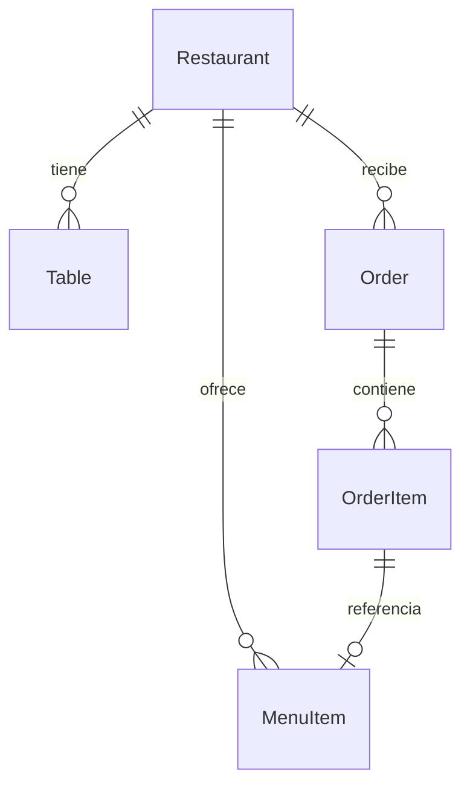

# 🍽️ GastroSync S.L.

**SaaS de digitalización para hostelería con sincronización en tiempo real.**

GastroSync conecta todos los flujos de trabajo de un restaurante en tiempo real mediante WebSockets: comandas digitales, visión de cocina, gestión de mesas y menú digital.

**🔗 Demo:** https://cosmic-salmiakki-4888ca.netlify.app/

## ✨ Características

- **Comandas en tiempo real** — Los pedidos del camarero llegan al instante a la cocina
- **Visión de cocina** — Interfaz adaptada con Dark Mode para reducir fatiga visual
- **Gestión de mesas** — Estado en vivo de cada mesa (libre/ocupada/reservada)
- **Menú digital** — Catálogo de platos con precios y categorías
- **Multi-restaurante** — Arquitectura preparada para escalar a múltiples locales

## 🛠️ Stack Tecnológico

| Capa | Tecnología | ¿Por qué? |
|------|-----------|-----------|
| **Frontend** | React 18 + Vite | Renderizado rápido, componentes modulares |
| **Backend** | Node.js + Express | Alto rendimiento I/O, ideal para WebSockets |
| **Tiempo real** | Socket.IO | Sincronización bidireccional < 300ms |
| **Validación** | Zod | Schemas tipados para REST y WebSockets |
| **Base de datos** | MongoDB Atlas (free tier) | Documentos flexibles para menús/pedidos |
| **Despliegue** | Render + Netlify (free tiers) | Hosting gratuito con HTTPS incluido |

## 🚀 Inicio rápido

### Requisitos

- Node.js 18+
- MongoDB Atlas (cuenta gratuita en [mongodb.com/atlas](https://mongodb.com/atlas))

### 1. Clonar e instalar

```bash
git clone https://github.com/alfonsopixota/gastrosync.git
cd gastrosync

# Backend
cd backend
cp .env.example .env
# Editar .env con tu MONGODB_URI
npm install
npm run dev

# Frontend (otra terminal)
cd frontend
npm install
npm run dev
```

### 2. Configurar variables de entorno

Edita `backend/.env`:

```env
PORT=3000
MONGODB_URI=mongodb+srv://<usuario>:<contraseña>@cluster0.xxxxx.mongodb.net/gastrosync
CLIENT_URL=http://localhost:5173
```

Edita `frontend/.env` (opcional, solo si el backend no está en localhost):

```env
VITE_SOCKET_URL=http://localhost:3000
```

### 3. Sembrar datos de prueba (opcional)

```bash
cd backend
node src/seed.js
```

### 4. Abrir en el navegador

```
http://localhost:5173
```

## 🏗️ Estructura del proyecto

```
Proyecto gastrosync/
├── backend/
│   ├── server.js                  # Servidor Express + Socket.IO
│   ├── src/
│   │   ├── config/db.js           # Conexión MongoDB
│   │   ├── models/                # Modelos Mongoose
│   │   │   ├── Restaurant.js
│   │   │   ├── Table.js
│   │   │   ├── MenuItem.js
│   │   │   └── Order.js
│   │   ├── routes/                # API REST
│   │   │   ├── orders.js          # Pedidos activos + historial
│   │   │   ├── tables.js          # Gestión de mesas
│   │   │   └── menu.js            # Catálogo de menú
│   │   ├── socket/orderHandler.js # Handlers WebSocket
│   │   ├── validation/schemas.js  # Schemas Zod
│   │   └── seed.js                # Script de datos de prueba
│   └── package.json
├── frontend/
│   ├── index.html
│   ├── vite.config.js
│   ├── eslint.config.js
│   └── src/
│       ├── App.jsx                # Componente principal
│       ├── App.css                # Estilos (incluye dark mode cocina)
│       ├── pages/
│       │   ├── WaiterView.jsx     # Vista camarero
│       │   └── KitchenView.jsx    # Vista cocina (dark mode)
│       └── socket/client.js       # Cliente Socket.IO
├── contributing.md
└── README.md
```

## 🌐 Despliegue gratis

### Backend en Render

1. Crea cuenta en [render.com](https://render.com) (GitHub login)
2. Nuevo Web Service → Conectar repo `gastrosync`
3. Configurar:
   - **Root Directory:** `backend`
   - **Build Command:** `npm install`
   - **Start Command:** `npm start`
   - **Plan:** Free
4. Añadir variables de entorno:
   - `MONGODB_URI` → URI de MongoDB Atlas
   - `PORT` → `3000`
   - `CLIENT_URL` → URL de Netlify (ej: `https://tusitio.netlify.app`)

### Frontend en Netlify

1. Crea cuenta en [netlify.com](https://netlify.com)
2. Importar repo → Configurar:
   - **Base directory:** `frontend`
   - **Build command:** `npm run build`
   - **Publish directory:** `frontend/dist`
3. Añadir variable de entorno:
   - `VITE_SOCKET_URL` → URL de Render (ej: `https://tusitio.onrender.com`)

## 📊 Modelo de datos



## 🎯 Roadmap

- [x] Comandas en tiempo real (WebSockets)
- [x] Vista camarero con selección de mesas
- [x] Vista cocina con Dark Mode
- [x] Gestión de mesas (REST + Socket)
- [x] Validación con Zod en todos los endpoints
- [x] Historial de pedidos paginado
- [x] Reconexión automática del socket
- [ ] Autenticación de usuarios
- [ ] Módulo de administración
- [ ] Informes y analytics
- [ ] App móvil para clientes (menú QR)
- [ ] Pasarela de pago integrada
- [ ] Tests unitarios y de integración
- [ ] Multilenguaje

## 📄 Licencia

Proyecto académico — DAW 2025-2026
Alfonso Ruiz García
